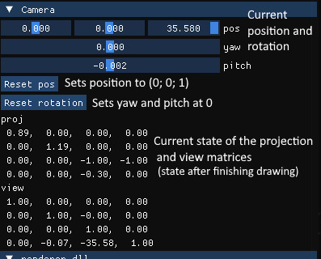
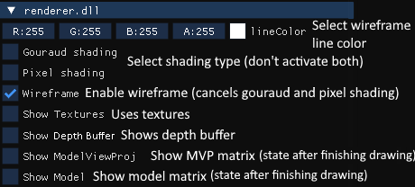
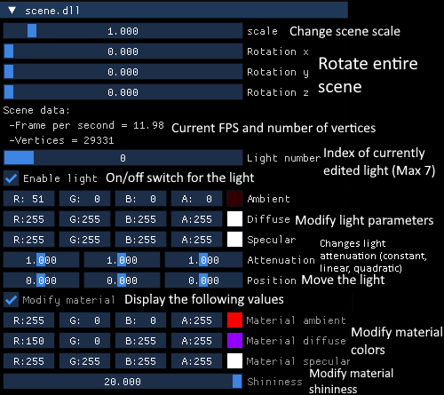
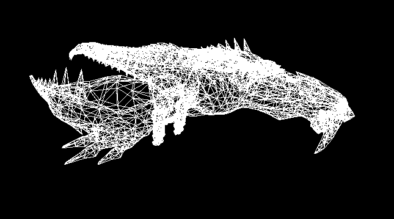
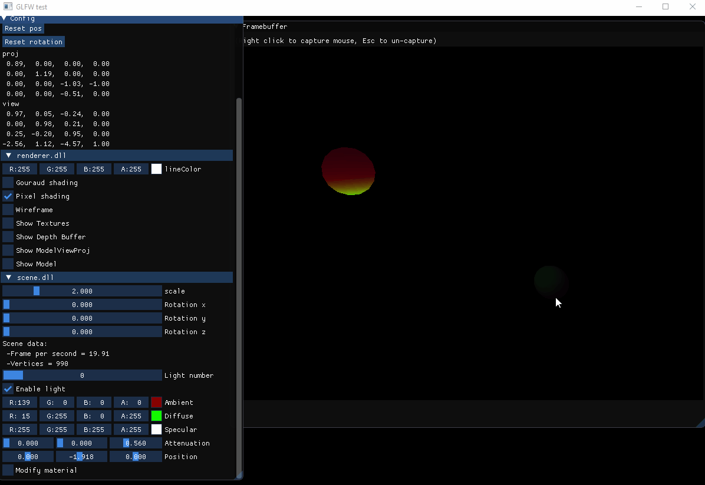
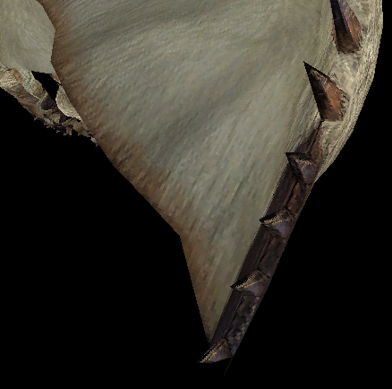
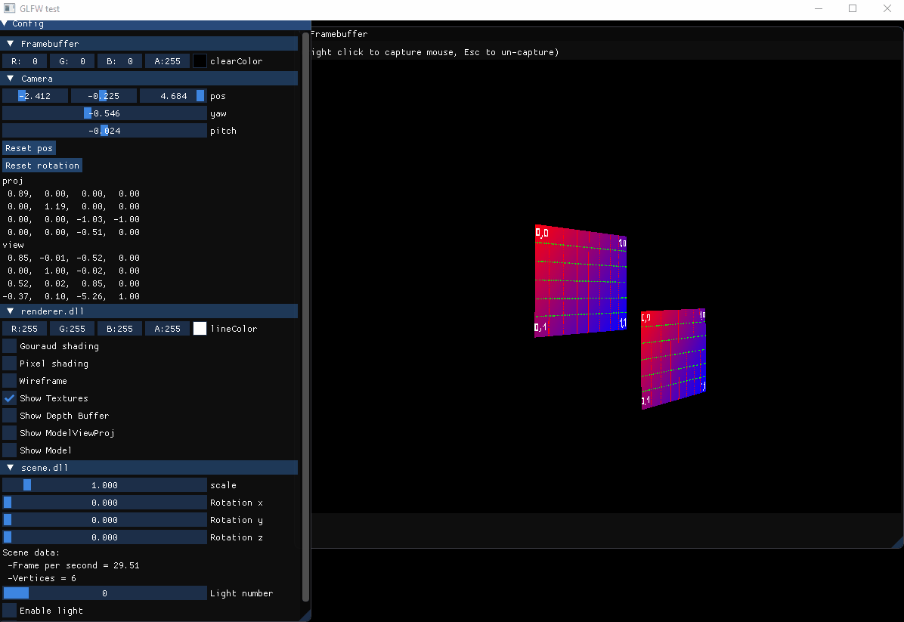
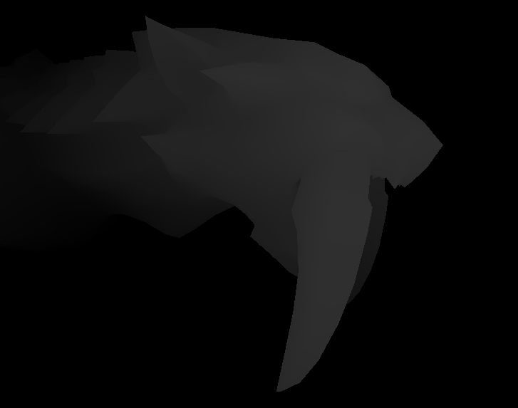
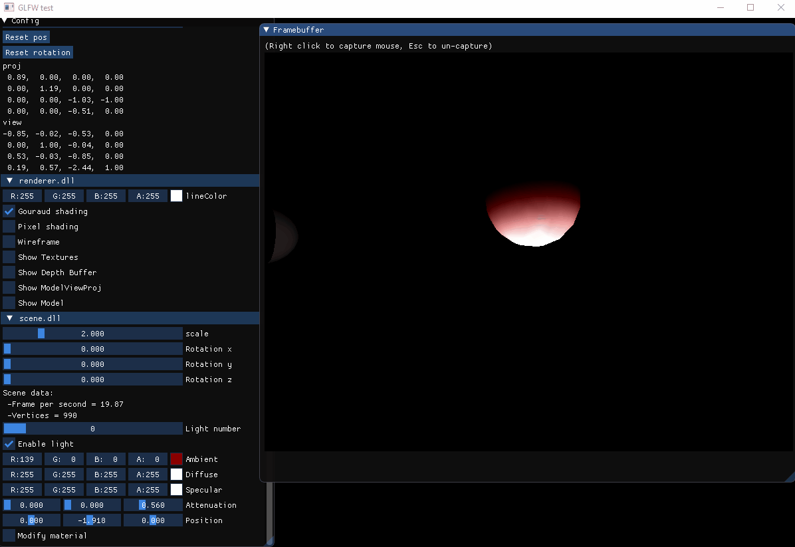
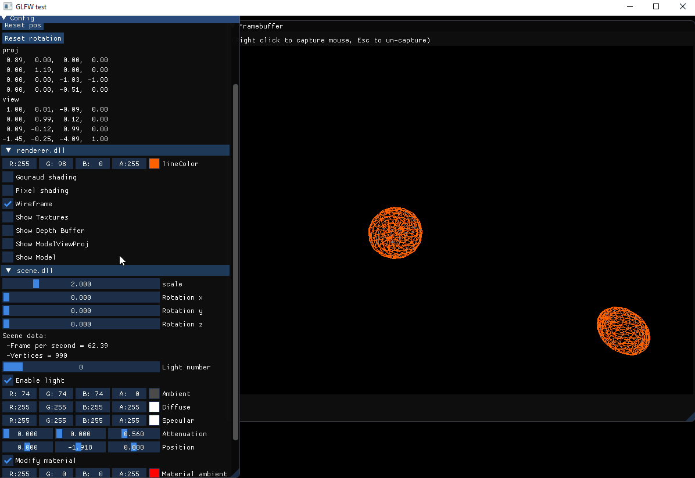

# Rasterizer

## Context

This is a school project I made during my first year. This project might not have the best coding practices as I was not as experienced as today, and I currently have no plan in cleaning, maintaining or imporving it. It is only here to showcase my knowledge and because I enjoyed this project. The rest of this ReadMe has not been modified since the project's end, and thus, might not be up to date at some points.  

## Currently implemented
---
Rendering using vertices and their colors using barycentric coordinates  
Perspective with working rotations and translation matrix  
Basic clipping  
Camera translation/rotation (ZQSD/arrow keys for horizontal movement, Lshift and space for vertical movement)  
Translation and rotation functions  
Vertex shader (For color and textures only)  
Texture rendering using UV coords  
Perspective correction  
Vertex shader for lightning  
8 functionnal lights with ambient and diffuse lighting and attenuation  
Pixel shading  
Materials  

## WIP (in priority order)
---
Lighting with specular values  
Back-face culling  
Optimisation and proper clipping  
Getting materials from TinyObjLoader  

## Interface presentation
---
The app consists in two ImGui windows: Config, which contains various ImGui components to handle the scene, and Framebuffer, which contains the rendered scene. This section will help you navigate through the config window.  

**Camera:**  
  
This section allows you to change the position and rotation of the camera with specific values. The position sliders are between -5.f and 5.f where the rotation ones are between -3.14f and 3.14f. You can also move the camera by right clicking the Framebuffer window and using Z,Q,S,D or the arrows to move horizontally, and space and Lshift to move up and down.  

**Renderer.dll:**  
  
This section allows you to change various rendering parameters. LineColor is the color of the lines in wireframe rendering, Gouraud and pixel shading are the shading types used by the renderer, and wireframe renders the scene in wireframe. Note that wireframe overrides both pixel and gouraud shading. If none of these three options are selected, the scene will be rendered using only vertex colors and textures (if textures are on).  

Show textures makes the renderer use textures bound to it and show depth buffer copies the depth buffer into the color buffer. The depth buffer does NOT cancel calculations due to gouraud and pixel shading and the implementation is pretty heavy on ressources, therefore it is recommended to turn off those two options before showing the depth buffer.  

Show modelViewProj and show Model displays the mvp and the model matrices right below the checkboxes, as in the camera header.  

**Scene.dll:**  
  
This section allows you to change and check various parameters from the scene. Note that the scene implementation is personal, therefore this header can be modified, unlike the precedent ones. The scale and rotation sliders manage the scale and the rotation of the entire scene.  

Scene data shows you the current frames per second and the amount of vertices currently loaded.  

The light number slider allows you to change the index of the light you are currently modifying. In the screenshot at the beginning of this section, we cans see that the light 0 is being modified. The checkbox right below indicates if the light is on or off. If the light is off, none of the following values will be displayed. The ambient, diffuse and specular sliders are the colors the light will have. The attenuation sliders represent the constant, linear and quadratic attenuation values, and are between 0.f and 2.f. The position slider allows you to move the light source and are in range -10.f, 10.f.  

The modify material checkbox acts the same way as the one from the lights, the values following it won't show if this isn't checked. The material ambient, diffuse and specular colors are the one of the material, aka the color it will reflect.  

## Demos
---
In this section, various visuals of the implemented features will be shown. It should help at clarifying the functions of the parameters described in the previous section. The monster model used for some of the followwing screenshots is the barioth model, from monster hunter tri on Wii.  

**Renderer:**  
  
This is the wireframe mode.  

  
This is the gouraud shading mode, also known as vertex shading.  

  
This is the pixel shading mode.   

  
This is the monster's texture applied on its wing using barycentric coordinates on a texture.  

  
This is a test texture on two moving quads to illustrate the perspective correction.  

  
This is the depth buffer used for the depth test during the rasterization process.  

**Scene:**  
  
This is the effect of the material on a sphere.  

  
This is the effect of the scale and rotation sliders on the scene.  

## External libraries
---
GLFW (Display in ImGui)  
ImGui (Parameters window/display window)  
Tinyobjloader (.obj loading)  
stbimage (texture loading)  

## Resources
---
**Coding:**    
-[Various matrices, explanations on the rendering pipeline (PDF from stanford university)](https://stanford.edu/class/ee267/lectures/lecture2.pdf)  
-[Perspective correction (PDF from UC Davis Engineering)](https://web.cs.ucdavis.edu/~amenta/s12/perspectiveCorrect.pdf)  
-[Perspective correction (Stack overflow topic)](https://stackoverflow.com/questions/24441631/how-exactly-does-opengl-do-perspectively-correct-linear-interpolation)  
-[Light attenuation using constant, linear and quadratic values (OGLdev)](http://ogldev.atspace.co.uk/www/tutorial20/tutorial20.html)  
-[Specular light (OGLdev)](http://ogldev.atspace.co.uk/www/tutorial19/tutorial19.html)  

**Wikipedia links:**  
-[Viewing frustum](https://en.wikipedia.org/wiki/Viewing_frustum#/media/File:ViewFrustum.svg)  
-[Barycentric coordinates](https://en.wikipedia.org/wiki/Barycentric_coordinate_system#Conversion_between_barycentric_and_Cartesian_coordinates)  
-[Projection matrix](https://en.wikipedia.org/wiki/3D_projection#Perspective_projection)  
-[Texture mapping](https://en.wikipedia.org/wiki/Texture_mapping)  
-[Back-face culling](https://en.wikipedia.org/wiki/Back-face_culling)  
-[Phong reflexion model](https://en.wikipedia.org/wiki/Phong_reflection_model)  
